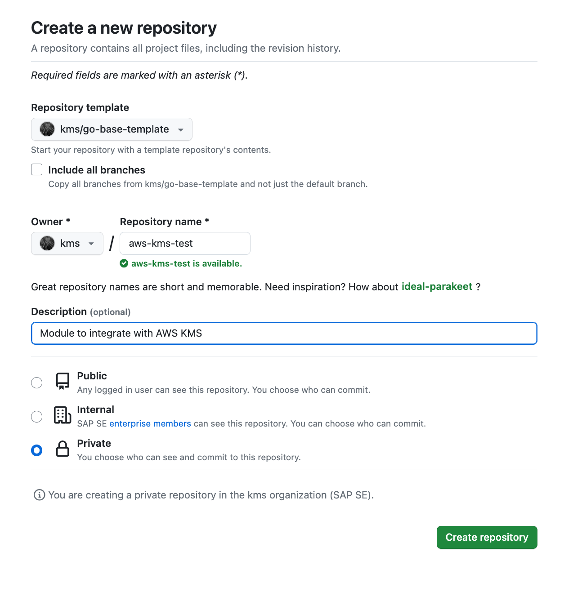
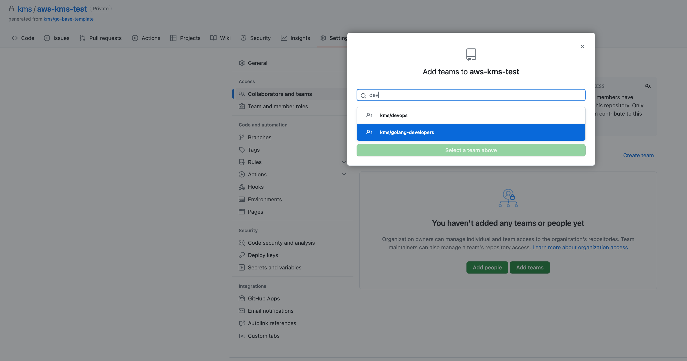
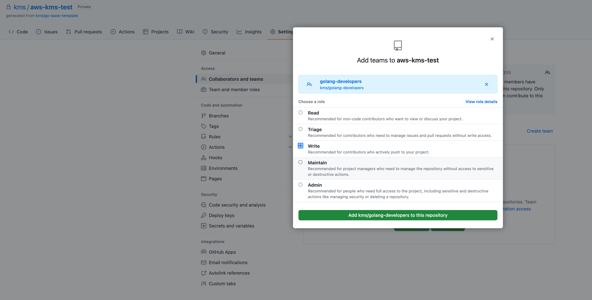
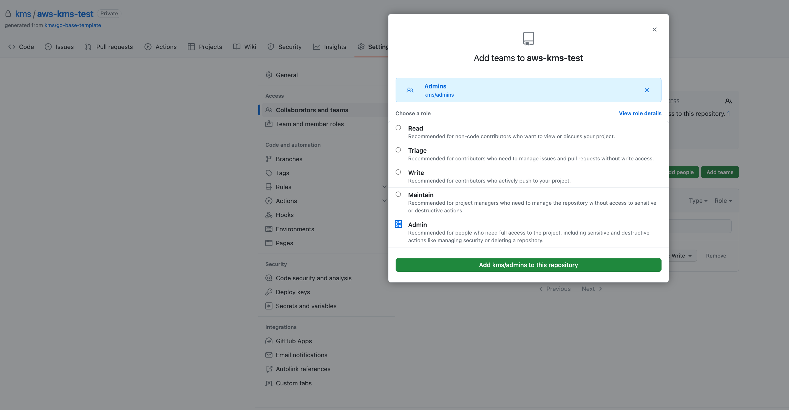
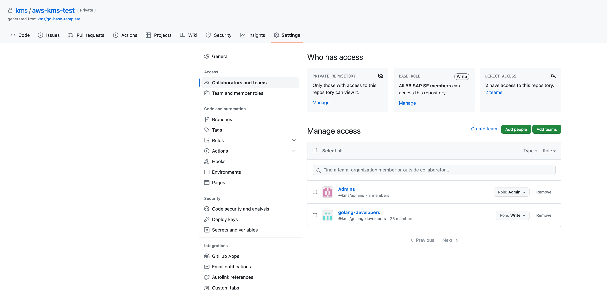
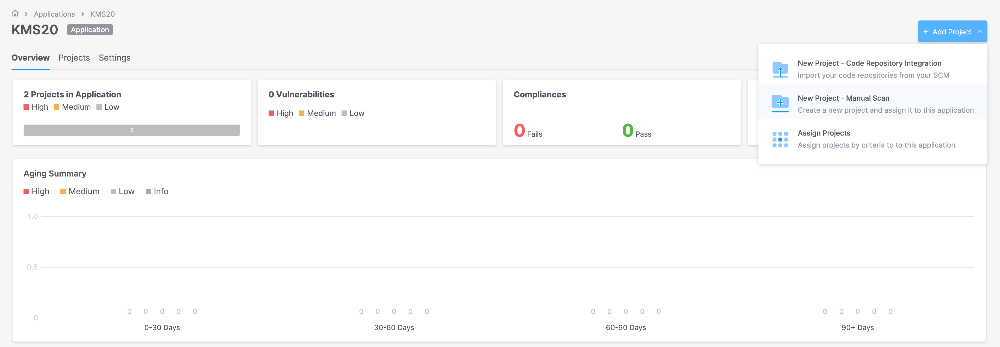
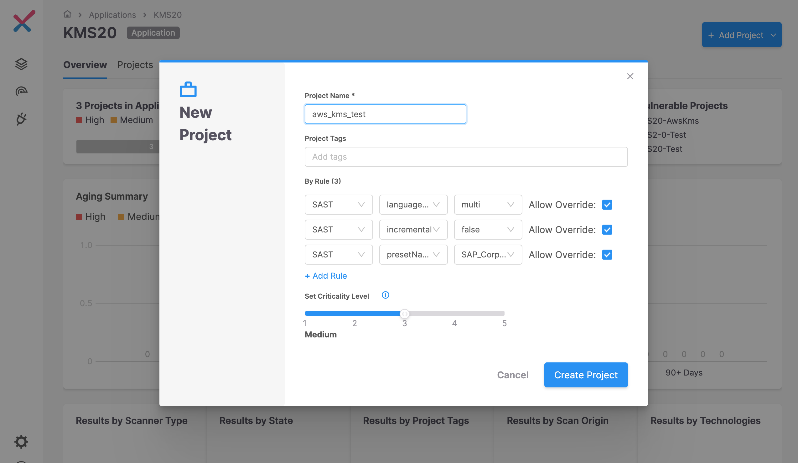

# Setup a new git repository using the base repository template

To setup a new golang repo the user must create a new repository under the kms organisation, selecting the golang-base-template repository template. When choosing a repository please use the following regex [a-z0-9-] for the repo name :

After clicking create repository, a new repository will be created which will inherit github actions from the template repository. Not everything can be automated so there are a few steps that need to be manually applied to the new repository for it to work.

Add the golang-developers team to the new repository under the repo settings -> Collaborators and Teams this will auto populate pull requests for the new repo. 

Click add and select write permissions

Now in a similar way add the golang admins with admin privileges

# Sonar Qube github action

Sonar Qube should work out of the box, you can navigate to https://sonar.tools.sap/projects/ where you will find your projects, the scan summary upon completion should provide a direct link to the project and the branch.

It is important to understand that not every problem reported by sonarqube requires a fix, for those problems relating to code smells etc., it is important just to audit the issue and mark it as a false positive or a won't fix with a small amount of text explaining the decision. Once the PR is merged any audits will be persisted across all branches for the project and should not occur again.

# CheckmarxOne setup

Navigate to the KMS20 application on checkmarxOne :
https://checkmarx.tools.sap/applications/13fa3177-e670-4b5f-b778-168a6d9ebc73/overview

Create a new project for the new repo:

The name specification for new projects is KMS20-<repo name>. So for repo AwsKms this would look like:

CheckmarxOne Github Action

Once the above setup is completed the checkmarx scan for the new repo should work to access the project simply navigate to https://checkmarx.tools.sap/applicationsAndProjects and select the project where you can access the scans and look at the configuration settings. All checkmarx scans run against development code will provide links in the github action summary, these can be used to audit issues and find information relating to the issue.

# Mend Github Action

Before the mend scan will not work for the new repository the go.mod must be added to the root directory.

All mend scans can be accessed through https://sap.whitesourcesoftware.com, the scan results will initially be stored in the SHC - SAP DATA CUSTODIAN product. Once we have new PPMS artefacts for KMS20 we will store the scans under the KMS20 product. The KMS20 product will all be centrally managed and no manual updates will be required to the new repo to transition between the product deliverables.

Within the SHC - DATA CUSTODIAN product the project naming convention will be KMS20-<repo-name>-<branch-name>. Use this convention to identify the project associated with the new repo.

For the initial setup the whitesource scan will run nightly against the repo, additionally users can manually run the gha against their branch if they so wish. 

Please ensure to check the whitesource scan results daily and raise a JIRA ticket to address any vulnerabilities flagged.

